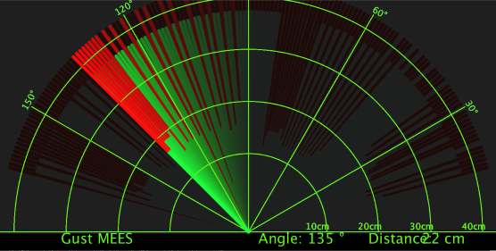
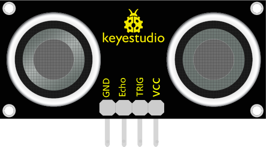
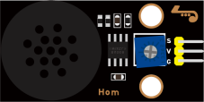
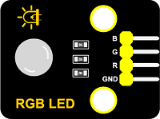
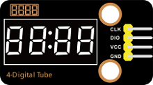
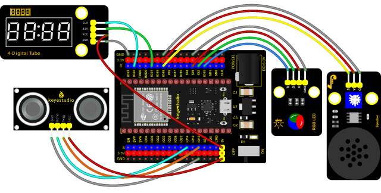

### Project 33: Ultrasonic Radar



**1. Description**


We know that bats use echoes to determine the direction and the location of their preys. In real life, sonar is used to detect sounds in the water. Since the attenuation rate of electromagnetic waves in water is very high, it cannot be used to detect signals, however, the attenuation rate of sound waves in the water is much smaller, so sound waves are most commonly used underwater for observation and measurement. In this experiment, we will use a speaker module, an RGB module and a 4-digit tube display to make a device for detection through ultrasonic.

**2. Required Components**

<table class="colwidths-auto docutils align-default">
<tbody>
<tr class="odd">
<td>


</td>
<td>

</td>
<td>

</td>
<td>

</td>
<td>

</td>
</tr>
<tr class="even">
<td>ESP32 Board*1</td>
<td>ESP32 Expansion Board*1</td>
<td>Keyestudio HC-SR04 Ultrasonic Sensor*1</td>
<td>Keyestudio 8002b Power Amplifier*1</td>
<td>Keyestudio DIY Common Cathode RGB Module *1</td>
</tr>
<tr class="odd">
<td>

</td>
<td>

</td>
<td>

</td>
<td>

</td>
<td></td>
</tr>
<tr class="even">
<td>Keyestudio DIY TM1650 4-Digit Display*1</td>
<td>4P Dupont Wire*3</td>
<td>3P Dupont Wire*1</td>
<td>Micro USB Cable*1</td>
<td></td>
</tr>
</tbody>
</table>

**3. Connection Diagram**



**4. Test Code**


```Python
from machine import Pin, PWM
import utime
 
# definitions for TM1650
ADDR_DIS = 0x48  #mode command
ADDR_KEY = 0x49  #read key value command

# definitions for brightness
BRIGHT_DARKEST = 0
BRIGHT_TYPICAL = 2
BRIGHTEST      = 7

on  = 1
off = 0

# number:0~9
NUM = [0x3f,0x06,0x5b,0x4f,0x66,0x6d,0x7d,0x07,0x7f,0x6f] 
# DIG = [0x68,0x6a,0x6c,0x6e]
DIG = [0x6e,0x6c,0x6a,0x68]
DOT = [0,0,0,0]

clkPin = 22
dioPin = 21
clk = Pin(clkPin, Pin.OUT)
dio = Pin(dioPin, Pin.OUT)

DisplayCommand = 0

def writeByte(wr_data):
    global clk,dio
    for i in range(8):
        if(wr_data & 0x80 == 0x80):
            dio.value(1)
        else:
            dio.value(0)
        clk.value(0)
        utime.sleep(0.0001)
        clk.value(1)
        utime.sleep(0.0001)
        clk.value(0)
        wr_data <<= 1
    return

def start():
    global clk,dio
    dio.value(1)
    clk.value(1)
    utime.sleep(0.0001)
    dio.value(0)
    return
    
def ack():
    global clk,dio
    dy = 0
    clk.value(0)
    utime.sleep(0.0001)
    dio = Pin(dioPin, Pin.IN)
    while(dio.value() == 1):
        utime.sleep(0.0001)
        dy += 1
        if(dy>5000):
            break
    clk.value(1)
    utime.sleep(0.0001)
    clk.value(0)
    dio = Pin(dioPin, Pin.OUT)
    return
    
def stop():
    global clk,dio
    dio.value(0)
    clk.value(1)
    utime.sleep(0.0001)
    dio.value(1)
    return
    
def displayBit(bit, num):
    global ADDR_DIS
    if(num > 9 and bit > 4):
        return
    start()
    writeByte(ADDR_DIS)
    ack()
    writeByte(DisplayCommand)
    ack()
    stop()
    start()
    writeByte(DIG[bit-1])
    ack()
    if(DOT[bit-1] == 1):
        writeByte(NUM[num] | 0x80)
    else:
        writeByte(NUM[num])
    ack()
    stop()
    return
    
def clearBit(bit):
    if(bit > 4):
        return
    start()
    writeByte(ADDR_DIS)
    ack()
    writeByte(DisplayCommand)
    ack()
    stop()
    start()
    writeByte(DIG[bit-1])
    ack()
    writeByte(0x00)
    ack()
    stop()
    return
    
    
def setBrightness(b = BRIGHT_TYPICAL):
    global DisplayCommand,brightness
    DisplayCommand = (DisplayCommand & 0x0f)+(b<<4)
    return

def setMode(segment = 0):
    global DisplayCommand
    DisplayCommand = (DisplayCommand & 0xf7)+(segment<<3)
    return
    
def displayOnOFF(OnOff = 1):
    global DisplayCommand
    DisplayCommand = (DisplayCommand & 0xfe)+OnOff
    return

def displayDot(bit, OnOff):
    if(bit > 4):
        return
    if(OnOff == 1): 
        DOT[bit-1] = 1;
    else:
        DOT[bit-1] = 0;
    return
        
def InitDigitalTube():
    setBrightness(2)
    setMode(0)
    displayOnOFF(1)
    for _ in range(4):
        clearBit(_)
    return

def ShowNum(num): #0~9999
    displayBit(1,num%10)
    if(num < 10):
        clearBit(2)
        clearBit(3)
        clearBit(4)
    if(num > 9 and num < 100):
        displayBit(2,num//10%10)
        clearBit(3)
        clearBit(4)
    if(num > 99 and num < 1000):
        displayBit(2,num//10%10)
        displayBit(3,num//100%10)
        clearBit(4)
    if(num > 999 and num < 10000):
        displayBit(2,num//10%10)
        displayBit(3,num//100%10)
        displayBit(4,num//1000)

pwm_r = PWM(Pin(0)) 
pwm_g = PWM(Pin(2))
pwm_b = PWM(Pin(15))

pwm_r.freq(1000)
pwm_g.freq(1000)
pwm_b.freq(1000)

def light(red, green, blue):
    pwm_r.duty(red)
    pwm_g.duty(green)
    pwm_b.duty(blue)

# Ultrasonic ranging, unit: cm
def getDistance(trigger, echo):
    # Generates a 10us square wave
    trigger.value(0)   #A short low level is given beforehand to ensure a clean high pulse:
    utime.sleep_us(2)
    trigger.value(1)
    utime.sleep_us(10)#After pulling high, wait 10 microseconds and immediately set it to low
    trigger.value(0)
    
    while echo.value() == 0: #Establish a while loop to detect whether the echo pin value is 0 and record the time at that time
        start = utime.ticks_us()
    while echo.value() == 1: #Establish a while loop to check whether the echo pin value is 1 and record the time at that time
        end = utime.ticks_us()
    d = (end - start) * 0.0343 / 2 #The travel time of the sound wave x the speed of sound (343.2 m/s, 0.0343 cm/microsecond), and the distance back and forth divided by 2.
    return d

# set the pin
trigger = Pin(13, Pin.OUT)
echo = Pin(14, Pin.IN)

buzzer = PWM(Pin(18))
def playtone(frequency):
    buzzer.duty(1000)
    buzzer.freq(frequency)

def bequiet():
    buzzer.duty(0)
    
# main program
InitDigitalTube()
while True:
    distance = int(getDistance(trigger, echo))
    ShowNum(distance)
    if distance <= 10:
        playtone(880)
        utime.sleep(0.1)
        bequiet()
        light(1023, 0, 0)
    elif distance <= 20:
        playtone(532)
        utime.sleep(0.2)
        bequiet()
        light(0, 0, 1023)
    else:
        light(0, 1023, 0)
```

**5. Code Explanation**

We set sound frequency and light color by adjusting different distance range.

We can adjust the distance range in the code.

**6. Test Result**

Connect the wires according to the experimental wiring diagram and power on. Click “Run current script”, the code starts executing. When the ultrasonic sensor detects different distances(within 20 cm), the buzzer will produce different frequencies of sound, the RGB will show different colors, and the measured distances are displayed on the 4-digit tube display. Press “Ctrl+C”or click “Stop/Restart backend”to exit the program.