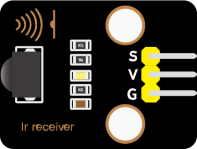
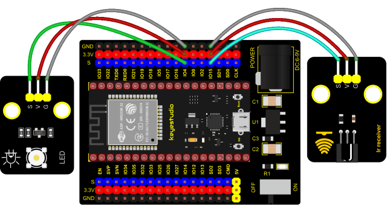
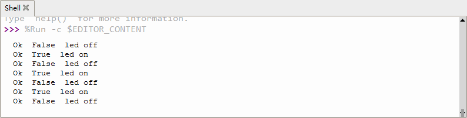

### Project 34: IR Remote Control


**1. Introduction**

In the previous experiments, we learned how to turn on/off the LED and adjust its brightness via PWM and print the button value of the IR  remote control in the Shell window. Herein, we use an infrared remote control to turn on/off an LED.

**2. Components**

<table class="colwidths-auto docutils align-default">
<tbody>
<tr class="odd">
<td>


</td>
<td>

</td>
<td>

</td>
<td>

</td>
</tr>
<tr class="even">
<td>ESP32 Board*1</td>
<td>ESP32 Expansion Board*1</td>
<td>Keyestudio White LED Module*1</td>
<td>Keyestudio DIY IR Receiver*1</td>
</tr>
<tr class="odd">
<td>

</td>
<td>

</td>
<td>

</td>
<td></td>
</tr>
<tr class="even">
<td>Micro USB Cable*1</td>
<td>IR Remote Control*1</td>
<td>3P Dupont Wire*2</td>
<td></td>
</tr>
</tbody>
</table>

**3. Connection Diagram**



**4. Test Code**


```Python
import time
from machine import Pin

led = Pin(4, Pin.OUT)
ird = Pin(15,Pin.IN)

act = {"1": "LLLLLLLLHHHHHHHHLHHLHLLLHLLHLHHH","2": "LLLLLLLLHHHHHHHHHLLHHLLLLHHLLHHH","3": "LLLLLLLLHHHHHHHHHLHHLLLLLHLLHHHH",
       "4": "LLLLLLLLHHHHHHHHLLHHLLLLHHLLHHHH","5": "LLLLLLLLHHHHHHHHLLLHHLLLHHHLLHHH","6": "LLLLLLLLHHHHHHHHLHHHHLHLHLLLLHLH",
       "7": "LLLLLLLLHHHHHHHHLLLHLLLLHHHLHHHH","8": "LLLLLLLLHHHHHHHHLLHHHLLLHHLLLHHH","9": "LLLLLLLLHHHHHHHHLHLHHLHLHLHLLHLH",
       "0": "LLLLLLLLHHHHHHHHLHLLHLHLHLHHLHLH","Up": "LLLLLLLLHHHHHHHHLHHLLLHLHLLHHHLH","Down": "LLLLLLLLHHHHHHHHHLHLHLLLLHLHLHHH",
       "Left": "LLLLLLLLHHHHHHHHLLHLLLHLHHLHHHLH","Right": "LLLLLLLLHHHHHHHHHHLLLLHLLLHHHHLH","Ok": "LLLLLLLLHHHHHHHHLLLLLLHLHHHHHHLH",
       "*": "LLLLLLLLHHHHHHHHLHLLLLHLHLHHHHLH","#": "LLLLLLLLHHHHHHHHLHLHLLHLHLHLHHLH"}

def read_ircode(ird):
    wait = 1
    complete = 0
    seq0 = []
    seq1 = []

    while wait == 1:
        if ird.value() == 0:
            wait = 0
    while wait == 0 and complete == 0:
        start = time.ticks_us()
        while ird.value() == 0:
            ms1 = time.ticks_us()
        diff = time.ticks_diff(ms1,start)
        seq0.append(diff)
        while ird.value() == 1 and complete == 0:
            ms2 = time.ticks_us()
            diff = time.ticks_diff(ms2,ms1)
            if diff > 10000:
                complete = 1
        seq1.append(diff)

    code = ""
    for val in seq1:
        if val < 2000:
            if val < 700:
                code += "L"
            else:
                code += "H"
    # print(code)
    command = ""
    for k,v in act.items():
        if code == v:
            command = k
    if command == "":
        command = code
    return command

flag = False
while True:
#     global flag
    command = read_ircode(ird)
    print(command, end = "  ")
    print(flag, end = "  ")
    if command == "Ok":
        if flag == True:
            led.value(1)
            flag = False
            print("led on")
        else:
            led.value(0)
            flag = True
            print("led off")
    time.sleep(0.1)
```

**5. Code Explanation**

We define a boolean variable. There are two boolean variables. true(true) or false (false).

When we press the OK button, the value of infrared reception is OK. At this time, we need to set a boolean variable flag. When the flag is true(true), the LED is turned on, and when it is false (false), the LED is turned off and turned on. After the LED is on and set it to false. We press the OK key, the LED will be off.

**6. Test Result**

Connect the wires according to the experimental wiring diagram and power on. Click “Run current script”, the code starts executing. Press the OK button of the remote, the LED will be on, press it again, the LED will be off.

Press “Ctrl+C”or click “Stop/Restart backend”to exit the program.

