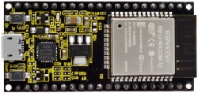
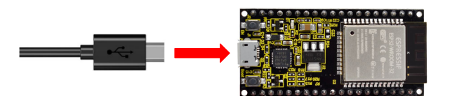
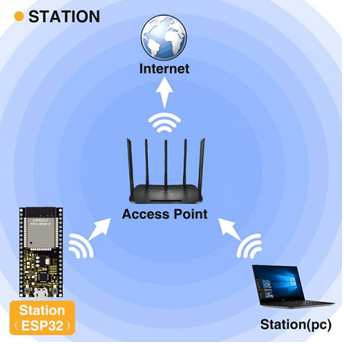
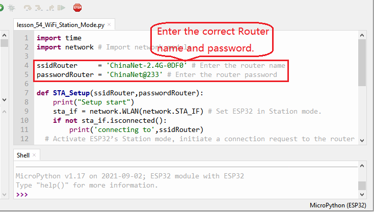
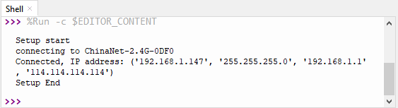

### Project 35：WIFI Station Mode

**1. Description**

ESP32 has three different WiFi modes: Station mode, AP mode and AP+Station mode. All WiFi programming projects must be configured with WiFi running mode before using, otherwise the WiFi cannot be used. In this project, we are going to learn the WiFi Station mode of the ESP32.

**2. Components**

<table class="colwidths-auto docutils align-default">
<tbody>
<tr class="odd">
<td>


</td>
<td>

</td>
</tr>
<tr class="even">
<td>USB Cable x1</td>
<td>ESP32*1</td>
</tr>
</tbody>
</table>

**3. Wiring Diagram**

Plug the ESP32 to the USB port of your PC



**4. Component Knowledge**

**Station mode：**

When setting Station mode, the ESP32 is taken as a WiFi client. It can connect to the router network and communicate with other devices on the router via a WiFi connection. As shown in the figure below, the PC and the router have been connected. If the ESP32 wants to communicate with the PC, the PC and the router need to be connected.



**5. Test Code**




```Python
import time
import network # Import network module.

ssidRouter     = 'ChinaNet-2.4G-0DF0' # Enter the router name
passwordRouter = 'ChinaNet@233' # Enter the router password

def STA_Setup(ssidRouter,passwordRouter):
    print("Setup start")
    sta_if = network.WLAN(network.STA_IF) # Set ESP32 in Station mode.
    if not sta_if.isconnected():
        print('connecting to',ssidRouter)
  # Activate ESP32’s Station mode, initiate a connection request to the router
  # and enter the password to connect.      
        sta_if.active(True)
        sta_if.connect(ssidRouter,passwordRouter)
  #Wait for ESP32 to connect to router until they connect to each other successfully.      
        while not sta_if.isconnected():
            pass
  # Print the IP address assigned to ESP32-WROVER in “Shell”. 
    print('Connected, IP address:', sta_if.ifconfig())
    print("Setup End")

try:
    STA_Setup(ssidRouter,passwordRouter)
except:
    sta_if.disconnect()
```


**6. Test Result**

Since the router name and password are different in various places, so before running the code, the user needs to enter the correct router name and password in the red box shown above.

After entering the correct router name and password, click“Run current script”, the code will start
executing.

The Shell monitor will print the IP address of the ESP32 when connecting the ESP32 to your router.

