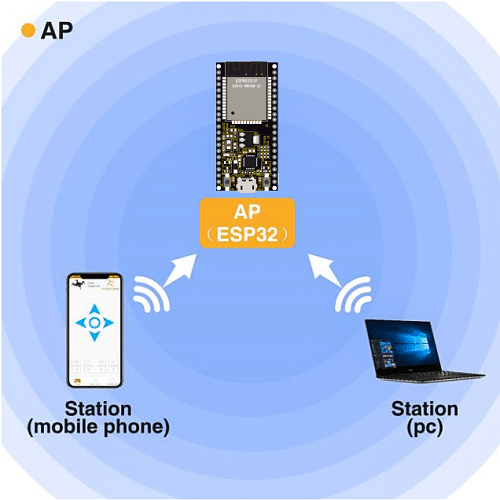
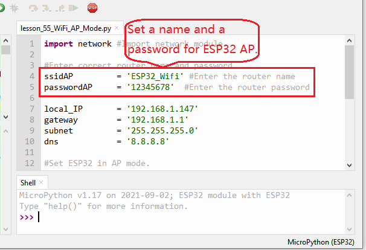
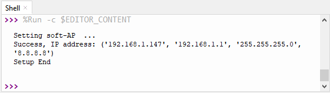

### Project 36：WIFI AP Mode

**1. Description**

In this project, we are going to learn the WiFi AP mode of the ESP32.

**2. Components**

<table class="colwidths-auto docutils align-default">
<tbody>
<tr class="odd">
<td>


</td>
<td>

</td>
</tr>
<tr class="even">
<td>USB Cable x1</td>
<td>ESP32*1</td>
</tr>
</tbody>
</table>

**3. Wiring Diagram**

Plug the ESP32 mainboard to the USB port of your PC


**4. Component Knowledge**

**AP Mode:**

When setting AP mode, a hotspot network will be created, waiting for other WiFi devices to connect. As shown below;

Take the ESP32 as the hotspot, if a phone or PC needs to communicate with the ESP32, it must be connected to the ESP32's hotspot. Communication is only possible after a connection is established via the ESP32.



**5. Test Code**




```Python
import network #Import network module.

#Enter correct router name and password.
ssidAP         = 'ESP32_Wifi' #Enter the router name
passwordAP     = '12345678'  #Enter the router password

local_IP       = '192.168.1.147'
gateway        = '192.168.1.1'
subnet         = '255.255.255.0'
dns            = '8.8.8.8'

#Set ESP32 in AP mode.
ap_if = network.WLAN(network.AP_IF)

def AP_Setup(ssidAP,passwordAP):
    ap_if.ifconfig([local_IP,gateway,subnet,dns])
    print("Setting soft-AP  ... ")
    ap_if.config(essid=ssidAP,authmode=network.AUTH_WPA_WPA2_PSK, password=passwordAP)
    ap_if.active(True)
    print('Success, IP address:', ap_if.ifconfig())
    print("Setup End\n")

try:
    AP_Setup(ssidAP,passwordAP)
except:
    print("Failed, please disconnect the power and restart the operation.")
    ap_if.disconnect()
```


**6. Test Result**

You can modify the AP name and password or keep them unchanged

Click “Run current script”, the code will start executing. Open the AP function of the ESP32, the Shell monitor will
print the information.



Turn on your phone's WiFi search function, then you can see the ssid\_AP which is called "ESP32\_Wifi" in this code. You can enter the password "12345678" to connect it, or you can modify its AP name and password by code.

