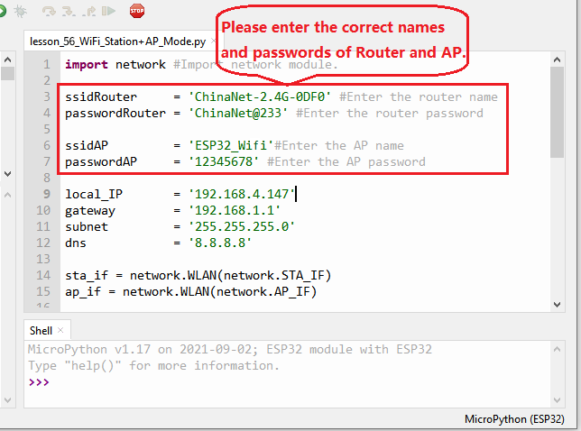
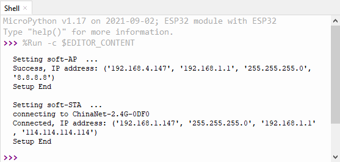
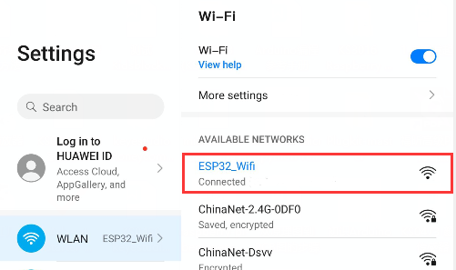

### Project 37：WIFI AP+Station Mode

**1. Description**

In this project, we are going to learn the AP+Station mode of the ESP32.

**2. Components**

|  |  |
| ------------------------------------------------------------ | ------------------------------------------------------------ |
| ESP32*1                                                      | USB Cable*1                                                  |

**3. Wiring Diagram**

Plug the ESP32 mainboard to the USB port of your PC


**4. Component Knowledge**

**AP+Station mode**

In addition to the AP mode and the Station mode, **AP+Station mode** can be used at the same time. Turn on the Station mode of the ESP32, connect it to the router network, and it can communicate with the Internet through the router. Then turn on the AP mode to create a hotspot network. Other WiFi devices can be connected to the router network or the hotspot network to communicate with the ESP32.

**5. Test Code**




```Python
import network #Import network module.

ssidRouter     = 'ChinaNet-2.4G-0DF0' #Enter the router name
passwordRouter = 'ChinaNet@233' #Enter the router password

ssidAP         = 'ESP32_Wifi'#Enter the AP name
passwordAP     = '12345678' #Enter the AP password

local_IP       = '192.168.4.147'
gateway        = '192.168.1.1'
subnet         = '255.255.255.0'
dns            = '8.8.8.8'

sta_if = network.WLAN(network.STA_IF)
ap_if = network.WLAN(network.AP_IF)
    
def STA_Setup(ssidRouter,passwordRouter):
    print("Setting soft-STA  ... ")
    if not sta_if.isconnected():
        print('connecting to',ssidRouter)
        sta_if.active(True)
        sta_if.connect(ssidRouter,passwordRouter)
        while not sta_if.isconnected():
            pass
    print('Connected, IP address:', sta_if.ifconfig())
    print("Setup End")
    
def AP_Setup(ssidAP,passwordAP):
    ap_if.ifconfig([local_IP,gateway,subnet,dns])
    print("Setting soft-AP  ... ")
    ap_if.config(essid=ssidAP,authmode=network.AUTH_WPA_WPA2_PSK, password=passwordAP)
    ap_if.active(True)
    print('Success, IP address:', ap_if.ifconfig())
    print("Setup End\n")

try:
    AP_Setup(ssidAP,passwordAP)    
    STA_Setup(ssidRouter,passwordRouter)
except:
    sta_if.disconnect()
    ap_if.idsconnect()
```


**6. Test Result**

Before running the code, you need to modify ssidRouter, passwordRouter, ssidAP, and passwordAP. After making sure that the code is modified correctly, click “Run current script” and the "Shell" window will display the following:



Then you can see the ssid\_A on the ESP32

