### Project 38: Comprehensive Experiment


**1. Introduction**

We did a lot of experiments, and for each one we needed to re-upload the code, so can we achieve different functions through an experiment? In this experiment, we will use an external button module to achieve different function.

**2. Components Required**

<table class="colwidths-auto docutils align-default">
<tbody>
<tr class="odd">
<td>


</td>
<td>

</td>
<td>

</td>
<td>

</td>
<td>

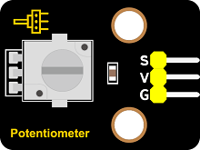</td>
</tr>
<tr class="even">
<td>ESP32 Board*1</td>
<td>ESP32 Expansion Board*11</td>
<td>Keyestudio White LED Module*1</td>
<td>Keyestudio Button Module*1</td>
<td>Keyestudio Rotary Potentiometer*1</td>
</tr>
<tr class="odd">
<td>

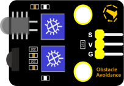</td>
<td>

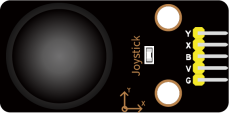</td>
<td>

</td>
<td>

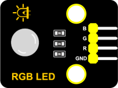</td>
<td>

</td>
</tr>
<tr class="even">
<td>Keyestudio Obstacle Avoidance Sensor*1</td>
<td>Keyestudio DIY Joystick Module*1</td>
<td>Keyestudio HC-SR04 Ultrasonic sensor *1</td>
<td>Keyestudio DIY Common Cathode RGB Module *1</td>
<td>MicroUSB Cable*1</td>
</tr>
<tr class="odd">
<td>

</td>
<td>

</td>
<td>

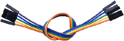</td>
<td></td>
<td></td>
</tr>
<tr class="even">
<td>3P Dupont Wire*4</td>
<td>4P Dupont Wire*2</td>
<td>5P Dupont Wire*1</td>
<td></td>
<td></td>
</tr>
</tbody>
</table>

**3. Wiring Diagram**

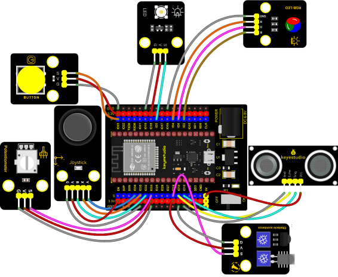

**4. Test Code**


```Python
from machine import ADC, Pin, PWM
import time
import machine
import random

pwm_r = PWM(Pin(4))
pwm_g = PWM(Pin(0))
pwm_b = PWM(Pin(2))

pwm_r.freq(1000)
pwm_g.freq(1000)
pwm_b.freq(1000)

potentiometer_adc=ADC(Pin(33))
potentiometer_adc.atten(ADC.ATTN_11DB)
potentiometer_adc.width(ADC.WIDTH_12BIT)

button = Pin(23, Pin.IN)
led = PWM(Pin(5))
led.freq(1000)

Avoiding = Pin(14, Pin.IN, Pin.PULL_UP)

button_z=Pin(32,Pin.IN,Pin.PULL_UP)
rocker_x=ADC(Pin(35))
rocker_y=ADC(Pin(34))
rocker_x.atten(ADC.ATTN_11DB)
rocker_y.atten(ADC.ATTN_11DB)
rocker_x.width(ADC.WIDTH_12BIT)
rocker_y.width(ADC.WIDTH_12BIT)

# Set ultrasonic pins
trigger = Pin(13, Pin.OUT)
echo = Pin(12, Pin.IN)

def light(red, green, blue):
    pwm_r.duty(red)
    pwm_g.duty(green)
    pwm_b.duty(blue)

# Ultrasonic ranging, unit: cm
def getDistance(trigger, echo):
    # Generates a 10us square wave
    trigger.value(0)   #A short low level is given beforehand to ensure a clean high pulse:
    time.sleep_us(2)
    trigger.value(1)
    time.sleep_us(10)#After pulling high, wait 10 microseconds and immediately set it to low
    trigger.value(0)
    
    while echo.value() == 0: #Establish a while loop to detect whether the echo pin value is 0 and record the time at that time
        start = time.ticks_us()
    while echo.value() == 1: #Establish a while loop to check whether the echo pin value is 1 and record the time at that time
        end = time.ticks_us()
    d = (end - start) * 0.0343 / 2 #The travel time of the sound wave x the speed of sound (343.2 m/s, 0.0343 cm/microsecond), and the distance back and forth divided by 2
    return d


keys = 0
nums = 0
print(keys % 5)
def toggle_handle(pin):
    global keys
    keys += 1
    print(keys % 4)

button.irq(trigger = Pin.IRQ_FALLING, handler = toggle_handle)

def showRGB():
    R = random.randint(0,1023)
    G = random.randint(0,1023)
    B = random.randint(0,1023)
    light(R, G, B)
    time.sleep(0.3)

def showAvoiding():
    if Avoiding.value() == 0:
        print("0   There are obstacles")   #Press to print the corresponding information.
    else:
        print("1   All going well")
    time.sleep(0.1) #delay 0.1s
    
def showJoystick():
    B_value = button_z.value()
    X_value = rocker_x.read()
    Y_value = rocker_y.read()
    print("button:", end = " ")
    print(B_value, end = " ")
    print("X:", end = " ")
    print(X_value, end = " ")
    print("Y:", end = " ")
    print(Y_value)
    time.sleep(0.1)

def adjustLight():
    pot_value = potentiometer_adc.read()
    print(pot_value)
    led.duty(pot_value)
    time.sleep(0.1)

def showDistance():
    distance = getDistance(trigger, echo)
    print("The distance is ：{:.2f} cm".format(distance))
    time.sleep(0.1)

while True:
    nums = keys % 5  #number of keystrokes mod 5 to get 0, 1, 2, 3, 4 
    if nums == 0:  #According to RGB
        showRGB()
    elif nums == 1:  #Displays the high and low level of the Avoiding sensor
        showAvoiding()
    elif nums == 2: #Displays the rocker value
        showJoystick()
    elif nums == 3:  #The potentiometer adjusts the LED
        adjustLight()
    elif nums == 4:  #Display ultrasonic ranging value
        showDistance()      
```


**5. Code Explanation**

1\. Calculate how many times the button is pressed, divide it by 5, and get the remainder which is 0, 1 2, 3, and 4. According to different remainders, construct five unique functions to control the experiment and realize different functions.

2\. Following the instructions, we can add or remove sensors/modules in the wiring, and then change the experimental function in the code.

**6. Test Result**

Connect the wires according to the experimental wiring diagram and power on. Click “Run current script”，the code starts executing. At the beginning, the number of the button is 0 and remainder is 0, RGB module will flash random color.

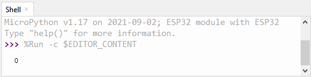

Press the button, the RGB stops flashing, press once, the remainder is 1. The function of the project is whether the obstacle avoidance sensor detects obstacles and reads high and low levels. The monitor will display as follows:

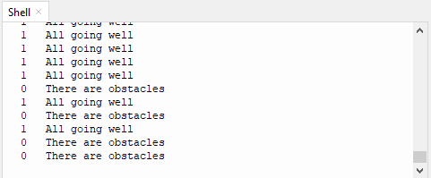

Press the button again, the time of pressing buttons is 2 and the remainder is 2. Read digital values at x, y and z axis of the joystick module. As shown below;

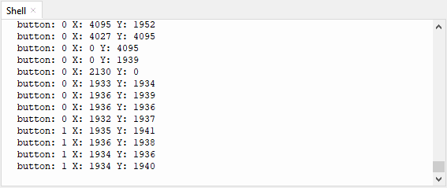

Press the key for the third time, the remainder is 3. Then the potentiometer can adjust the PWM value at the GPI05 port to control LED brightness of the purple LED.

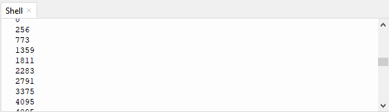

Press the key for the fourth time, the remainder is 4. Then the ultrasonic sensor can detect distance, as shown below:

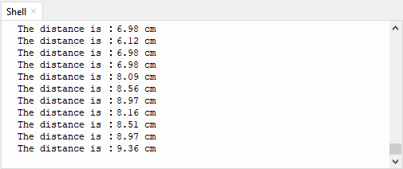

Press the key for the fifth time, the remainder is 0. Then the RGB will flash. If you press keys incessantly, remainders will change in a loop way. So does functions. Press “Ctrl+C”or click “Stop/Restart backend”to exit the program.