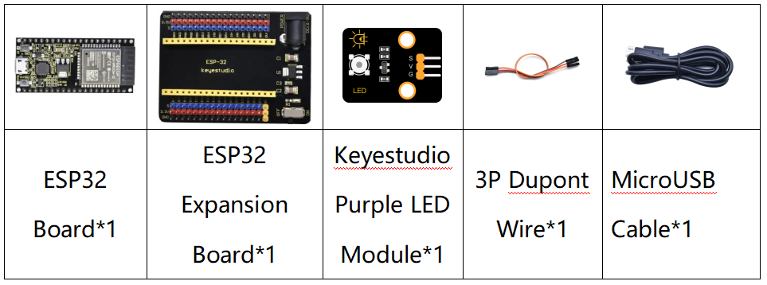

### Project 4: Breathing LED


**1. Overview**

A“breathing LED”is a phenomenon where an LED's brightness smoothly changes from dark to bright and back to dark, continuing to do so and giving the illusion of an LED“breathing. This phenomenon is similar to a lung breathing in and out. So how to control LED’s brightness? We need to take advantage of PWM. You may refer to Project 5.

**2. Components**



**3. Connection Diagram**


**4. Test Code**


```Python
import time
from machine import Pin,PWM

#The way that the ESP32 PWM pins output is different from traditionally controllers.
#It can change frequency and duty cycle by configuring PWM’s parameters at the initialization stage.
#Define GPIO 0’s output frequency as 10000Hz and its duty cycle as 0, and assign them to PWM.
pwm =PWM(Pin(0,Pin.OUT),10000)

try:
    while True:
#The range of duty cycle is 0-1023, so we use the first for loop to control PWM to change the duty
#cycle value,making PWM output 0% -100%; Use the second for loop to make PWM output 100%-0%.  
        for i in range(0,1023):
            pwm.duty(i)
            time.sleep_ms(1)
            
        for i in range(0,1023):
            pwm.duty(1023-i)
            time.sleep_ms(1)  
except:
#Each time PWM is used, the hardware Timer will be turned ON to cooperate it. Therefore, after each use of PWM,
#deinit() needs to be called to turned OFF the timer. Otherwise, the PWM may fail to work next time.
    pwm.deinit()
```


**5. Test Result**

Connect the wires according to the experimental wiring diagram and power on. Click “Run current script”, the code starts executing, we will see that the LED on the module gradually gets dimmer then brighter, cyclically, like human breathe. Press “Ctrl+C”or click“Stop/Restart backend”to exit the program.