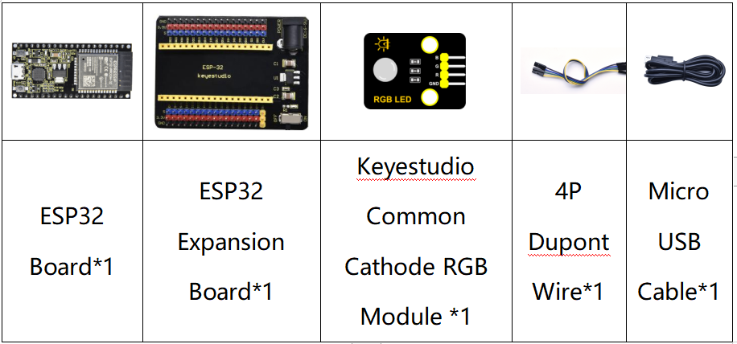
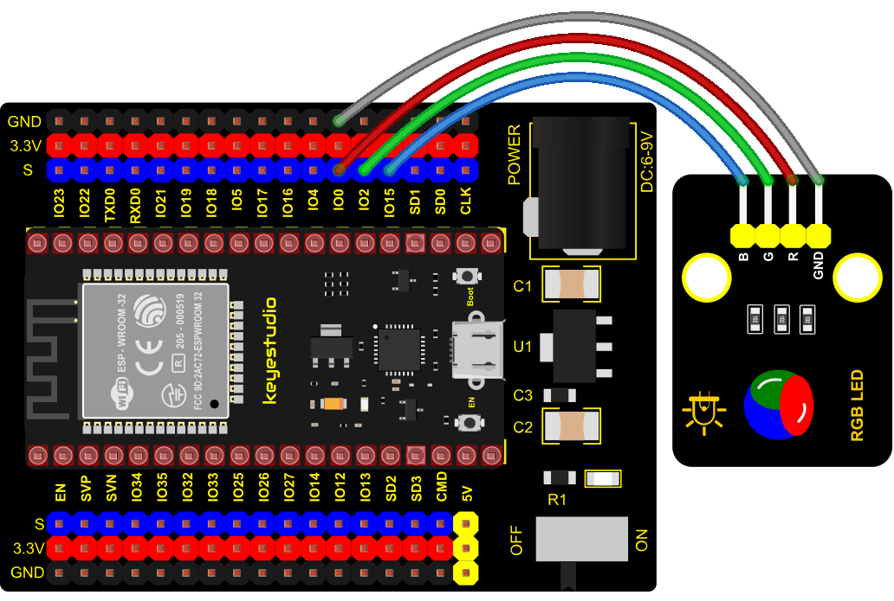

### Project 5: RGB Module


**1. Overview**

Among these modules is a RGB module. It adopts a F10-full color RGB foggy common cathode LED. We connect the RGB module to the PWM port of MCU and the other pin to GND(for common anode RGB, the rest pin will be connected to VCC). So what is PWM?

PWM is a means of controlling the analog output via digital means. Digital control is used to generate square waves with different duty cycles (a signal that constantly switches between high and low levels) to control the analog output. In general, the input voltages of ports are 0V and 5V. What if the 3V is required? Or a switch among 1V, 3V and 3.5V? We cannot change resistors constantly. For this reason, we resort to PWM.


For Arduino digital port voltage outputs, there are only LOW and HIGH levels, which correspond to the voltage outputs of 0V and 5V respectively. You can define LOW as“0”and HIGH as“1’, and let the Arduino output five hundred‘0’or“1”within 1 second. If output five hundred‘1’, that is 5V; if all of which is‘0’,that is 0V; if output 25001 pattern, that is 2.5V.

This process can be likened to showing a movie. The movie we watch are not completely continuous. Actually, it generates 25 pictures per second, which cannot be told by human eyes. Therefore, we mistake it as a continuous process. PWM works in the same way. To output different voltages, we need to control the ratio of 0 and 1. The more ‘0’or‘1’ output per unit time, the more accurate the control.

**2. Working Principle**

For our experiment, we will control the RGB module to display different colors through three PWM values.


**3. Components**



**4. Connection Diagram**
    
 

**5. Test Code**

```Python
# import Pin, PWM and Random function modules.
from machine import Pin, PWM
from random import randint
import time

#Configure ouput mode of GPIO0, GPIO2 and GPIO15 as PWM output and PWM frequency as 10000Hz.
pins = [0, 2, 15]

pwm0 = PWM(Pin(pins[0]),10000)  
pwm1 = PWM(Pin(pins[1]),10000)
pwm2 = PWM(Pin(pins[2]),10000)

#define a function to set the color of RGBLED.
def setColor(r, g, b):
    pwm0.duty(1023-r)
    pwm1.duty(1023-g)
    pwm2.duty(1023-b)
    
try:
    while True:
        red   = randint(0, 1023) 
        green = randint(0, 1023)
        blue  = randint(0, 1023)
        setColor(red, green, blue)
        time.sleep_ms(200)
except:
    pwm0.deinit()
    pwm1.deinit()
    pwm2.deinit()
```

**6. Test Result**

Connect the wires according to the experimental wiring diagram and power on. Click “Run current script”, the code starts executing, we will see that the RGB LED on the module starts to display random colors. Press “Ctrl+C”or click“Stop/Restart backend” to exit the program.