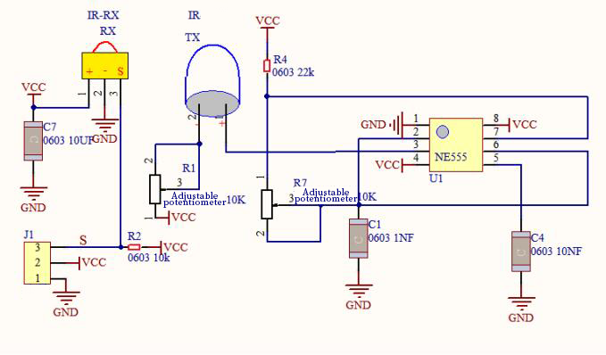
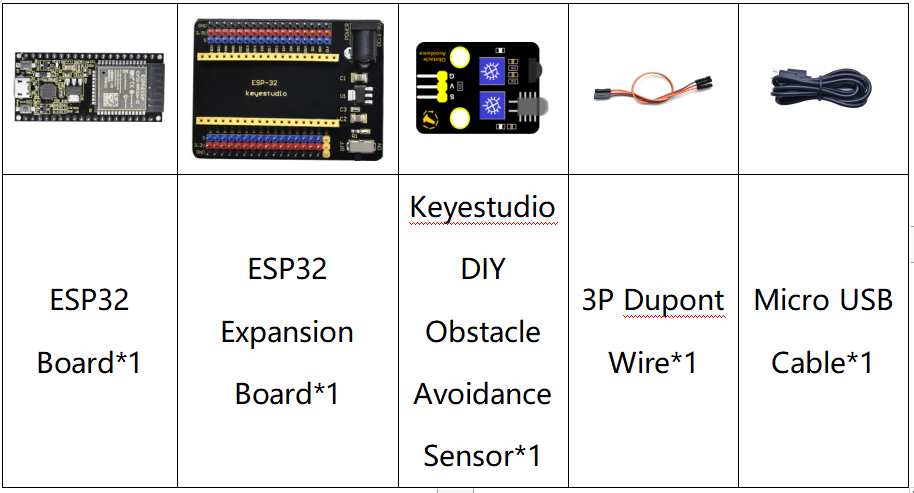
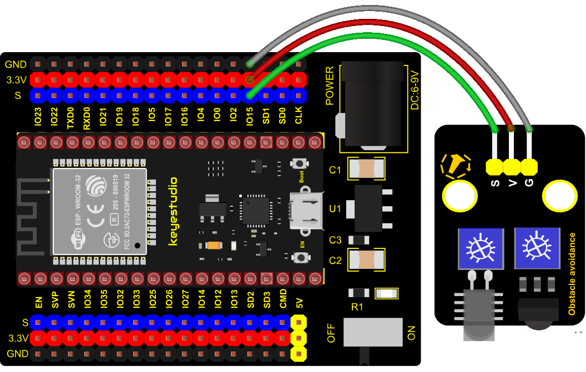
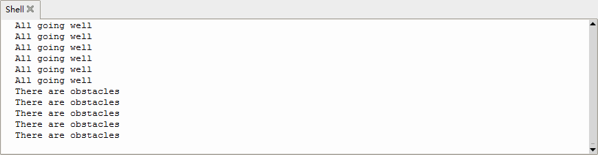

### Project 7: Obstacle Avoidance Sensor


**1. Overview**

In this kit, there is a Keyestudio obstacle avoidance sensor, which mainly uses an infrared emitting and a receiving tube. In the experiment, we will determine whether there is an obstacle by reading the high and low level of the S terminal on the sensor.

**2. Working Principle**

NE555 circuit provides IR signals with frequency to the emitter TX, then the IR signals will fade with the increase of transmission distance. If encountering the obstacle, it will be reflected back.

When the receiver RX meets the weak signals reflected back, the receiving pin will output high levels, which indicates the obstacle is far away. On the contrary, it the reflected signals are stronger, low levels will be output, which represents the obstacle is close. There are two potentiometers on the module, and by adjusting the two potentiometers, we can adjust its effective distance.



**3. Components**



**4. Connection Diagram**



**5. Test Code**

```Python
from machine import Pin
import time

sensor = Pin(15, Pin.IN)
while True:
    if sensor.value() == 0:
        print("There are obstacles")
    else:
        print("All going well")
    time.sleep(0.1)
```


**6. Code Explanation**

<span style="color: rgb(255, 76, 65);">Note:</span>

Connect the wires according to the connection diagram. After powering on, we start to adjust the two potentiometers to sense distance.

**7. Test Result**

Connect the wires according to the experimental wiring diagram and power on. Click “Run current script”, the code starts executing, the string will be displayed in the ”Shell“ window. When the sensor detects the obstacle, sensor.value() is 0，the shell will show“There are obstacles”, if the obstacle is not detected, sensor.value () is 1,“All going well”will be shown, as shown below.
Press “Ctrl+C”or click“Stop/Restart backend”to exit the program.

