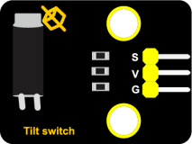
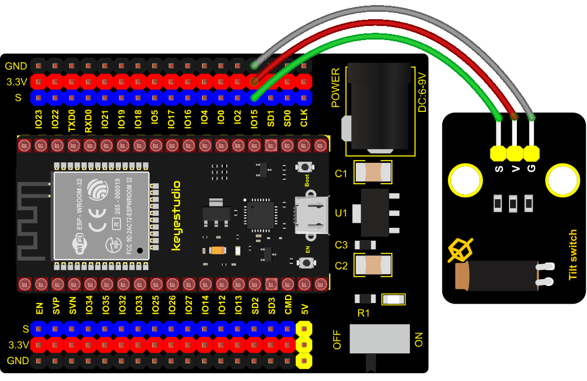

### Project 8: Tilt Module


**1. Overview**

In this kit, there is a Keyestudio tilt sensor. The tilt switch can output signals of different levels according to whether the module is tilted. There is a ball inside. When the switch is higher than the horizontal level, the switch is turned on, and when it is lower than the horizontal level, the switch is turned off. This tilt module can be used for tilt detection, alarm or other detection.

**2. Working Principle**

The working principle is pretty simple. When pin 1 and 2 of the ball switch P1 are connected, the signal S is low level and the red LED will light up; when they are disconnected, the pin will be pulled up by the 4.7K R1 and make S a high level, then LED will be off.


**3. Components**

<table class="colwidths-auto docutils align-default">
<tbody>
<tr class="odd">
<td>


></td>
<td>

</td>
<td>

</td>
<td>

</td>
<td>

</td>
</tr>
<tr class="even">
<td>ESP32 Board*1</td>
<td>ESP32 Expansion Board*1</td>
<td><p>Keyestudio</p>

<p>Tilt Sensor*1</p></td>

<td>3P Dupont Wire*1</td>
<td>Micro USB Cable*1</td>
</tr>
</tbody>
</table>

**4. Connection Diagram**



**5. Test Code**

```Python
from machine import Pin
import time

TiltSensor = Pin(15, Pin.IN)

while True:
    value = TiltSensor.value()
    print(value, end = " ")
    if  value== 0:
        print("The switch is turned on")
    else:
        print("The switch is turned off")
    time.sleep(0.1)
```


**6. Test Result**

Connect the wires according to the experimental wiring diagram and power on. Click “Run current script”, the code starts executing, the string and the data will be displayed in the ”Shell“ window. When the tilt module is inclined to one side, the red LED on the module will be off and the Shell“ window will display“1 The switch is turned off”. In contrast, if you make it incline the other side, the red LED will light up and the monitor will display“0 The switch is turned on”, as shown below. Press “Ctrl+C”or click“Stop/Restart backend”to exit the program.

