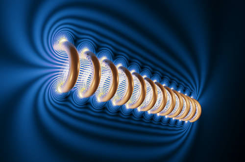
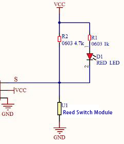
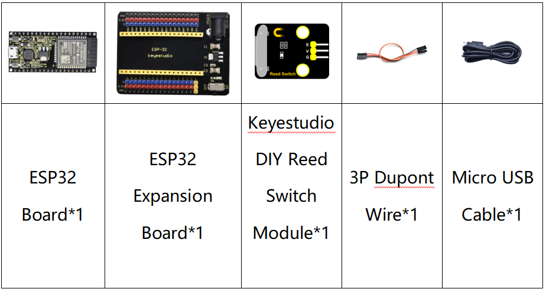
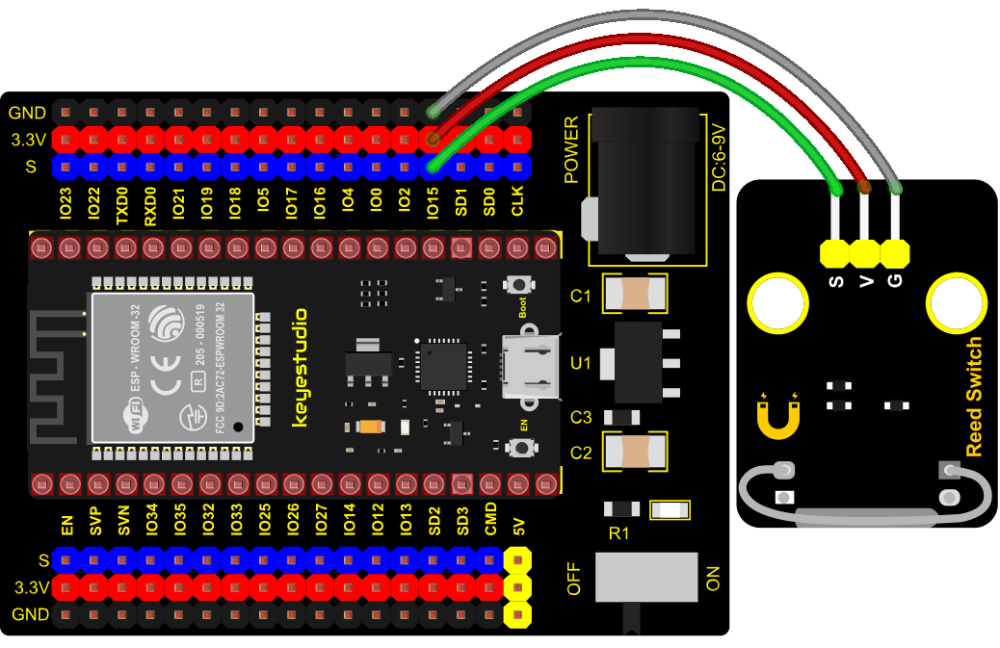

### Project 9: Reed Switch Module



**1. Overview**

In this kit, there is a Keyestudio reed switch module, which mainly uses a MKA10110 green reed component.

The reed switch is the abbreviation of the dry reed switch. It is a passive electronic switch element with contacts.

It has the advantages of simple structure, small size and easy control. Its shell is a sealed glass tube with two iron elastic reed electric plates.

In the experiment, we will determine whether there is a magnetic field near the module by reading the high and low level of the S terminal on the module; and, we display the test result in the shell.

**2. Working Principle**

In normal conditions, the glass tube in the two reeds made of special materials are separated. When a magnetic substance close to the glass tube, in the role of the magnetic field lines, the pipe within the two reeds are magnetized to attract each other in contact, the reed will suck together, so that the junction point of the connected circuit communication.

After the disappearance of the outer magnetic reed because of their flexibility and separate, the line is disconnected. The sensor uses this characteristic to build a circuit to convert magnetic field signal into high and low level signal.  



**3. Components**



**4. Connection Diagram**



**5. Test Code**


```Python
from machine import Pin
import time

ReedSensor = Pin(15, Pin.IN)
while True:
    value = ReedSensor.value()
    print(value, end = " ")
    if value == 0:
        print("A magnetic field")
    else:
        print("There is no magnetic field")
    time.sleep(0.1)
```


**6. Test Result**

Connect the wires according to the experimental wiring diagram and power on. Click “Run current script”, the code starts executing, the string and the data will be displayed in the ”Shell“ window.

When the sensor detects a magnetic field, val is 0 and the red LED of the module lights up, "0 A magnetic field" will be displayed. When no magnetic field is detected, val is 1, and the LED on the module goes out, "1 There is no magnetic field" will be shown, as shown below. Press “Ctrl+C”or click“Stop/Restart backend”to exit the program.

