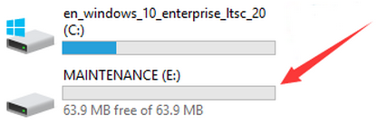
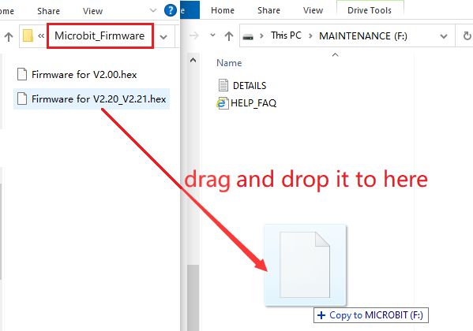
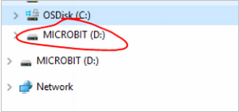
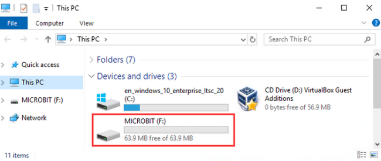
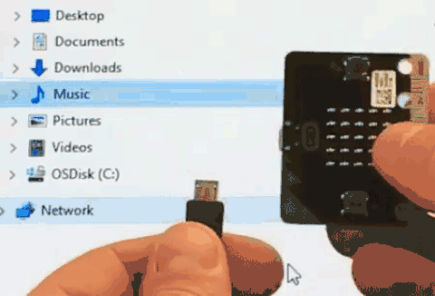

# 4. Troubleshooting

Solutions for the issue where Micro:bit V2 board fails to download programs and displays **MAINTENANCE**.

---------------

### 1. Problems

Many new users have recently encountered this issue: When they plug the Micro:bit V2 board into the computer via a Micro USB cable and click on "**Download**", the code fails to download and the Micro:bit V2 board shows no response.

If you were accidentally holding the reset button at the back of the Micro:bit V2 board at the time you copied the program onto it, this would have put the board into maintenance mode. Or perhaps due to some of your own mistakes, the firmware on the Micro:bit V2 board is lost.

As a result, a new **MAINTENANCE** drive will appear in your file manager, so the Micro:bit V2 board will not accept your user code. 

The **MAINTENANCE** drive will look like this, depending on your computer:

---------------

### 2. Solutions

(1). Download the **.hex** file appropriate for your version of the Micro:bit from this page to your computer.

**Tip 1:** Click to download <u>[the latest Micro:bit firmware-0255 .hex file](https://www.microbit.org/get-started/user-guide/firmware/)</u>. If you have a Micro:bit V2 board (with speaker and microphone), there are two possible versions of the firmware: V2.00 and V2.20/2.21. Please select the firmware appropriate to your Micro:bit V2 board.

**Tip 2:** We also provide you with the latest Micro:bit firmware-0255 .hex file: <u>[Micro:bit_Firmware](./Microbit_Firmware.7z)</u>.

(2). Drag and drop the **.hex** file you downloaded from this page onto the **MAINTENANCE** drive. Note that the firmware varies from the model of Micro:bit V2 board. Here is Firmware for V2.20_V2.21. When the upgrade is completed, the Micro:bit will reset, ejecting itself from the computer and re-appear in normal **MICROBIT** drive mode.

---------------

### 3. How to avoid entering "**MAINTENANCE**" Mode

(1). Do not press the reset button at the back of the Micro:bit V2 board when it is connected to a Micro USB cable.

If the reset button is pressed while powering up the Micro:bit V2 board (even after you loaded the .hex file), the Micro:bit V2 board will go into maintenance mode. (**Common mistakes made by beginners**)

(2). Do not unplug it suddenly during downloading program. Or the firmware may be lost, and the Micro:bit V2 board will enter the MAINTENANCE mode.

(3). During the experiment, wrong wiring will also result in a short circuit so the Micro:bit firmware may be lost. Beginners must pay attention when operating.

---------------

### 4. Troubleshooting downloading using WebUSB

Your Micro:bit V2 board appears to have developed a fault with WebUSB (/ device/ usb/ webusb) ? Let's try to figure out the reason.

**Step 1: Test on micro USB cable**

Plug the Micro:bit V2 board into your computer with a Micro USB cable. It should appear as a **MICROBIT** drive.

If **MICROBIT** appears as a drive under Devices and drives, go to Step 2. 

If not, please try: (a) another cable; (b) another USB port on your computer; (c) connecting the Micro:bit to another computer. 

Some Micro USB cables may only offer a power connection and do not actually transmit data, and some computers may power down their Micro USB ports for some reason. 

You still cannot see the **MICROBIT** drive ? Hum, there might be a problem with your Micro:bit V2 board. See the article on <u>[troubleshooting with the microbit.org](https://support.microbit.org/solution/articles/19000024000-fault-finding-with-a-micro-bit)</u> or open a <u>[support ticket](https://support.microbit.org/support/tickets/new)</u> to notify the Micro:bit Foundation of the issue. And, skip all the following steps.

**Step 2: Checking your firmware version**

To find out what version of the firmware you have on your Micro:bit V2 board:

①. Plug it into a computer using the Micro USB cable and open **MICROBIT** drive.

②. Open the **DETAILS.TXT** file.

③. Look for the number on the line that begins "**Interface Version / Bootloader Version**".

If it is 0234/0241/0243/0249, you need to update the firmware on your Micro:bit V2 board. Go to Step 3 for the update.

If it is 0255/0257 or higher, go to Step 4.

**Step 3: How to update the firmware**

If you need to update the firmware to access a new feature or troubleshoot a problem, here is how to do it:

①. Disconnect the Micro USB cable and battery pack from the Micro:bit V2 board.

②. Hold the reset button at the back of the Micro:bit V2 board and plug the Micro USB cable into the Micro:bit V2 board and your computer. You should see a drive appear in your file manager called **MAINTENANCE** (instead of MICROBIT) and the yellow LED indicator on the back should light up.

③. Click to download [firmware .hex file](https://microbit.org/guide/firmware/) appropriate for your version of the Micro:bit. Here is Firmware for V2.20_V2.21.

④. Drag and drop the .hex firmware into the **MAINTENANCE** drive.

⑤. Wait for the yellow LED on the back of the Micro:bit V2 board to stop flashing. After copying, the LED will turn off and the Micro:bit V2 board will reset. **MAINTENANCE** will be back to **MICROBIT**.

⑥. Finally, check the DETAILS.TXT file that is on the **MICROBIT** drive and make sure that it has the same version number as the "**.hex**" firmware.

For any issues of the board, maintenance mode and firmware updates, please refer to the <u>[Firmware Guide](https://microbit.org/guide/firmware/)</u> .

**Step 4: Checking your browser version**

WebUSB is a relatively new function that you may update your browser. Check if your browser is: (a) compatible with Android, Chrome OS; (b) Microsoft Edge; (c) the Chrome 65+ of Linux, macOS and Windows 10/11.

**Step 5: Connecting a device**

Open **Google Chrome / Microsoft Edge** to go to the MakeCode editor, and click on the "**Connect Device**". For how to pair a device, please refer to <u>[WebUSB (/ device/ usb/ webusb)](https://microbit.org/get-started/user-guide/web-usb/)</u> . 

Enjoy quick download!

---------------

